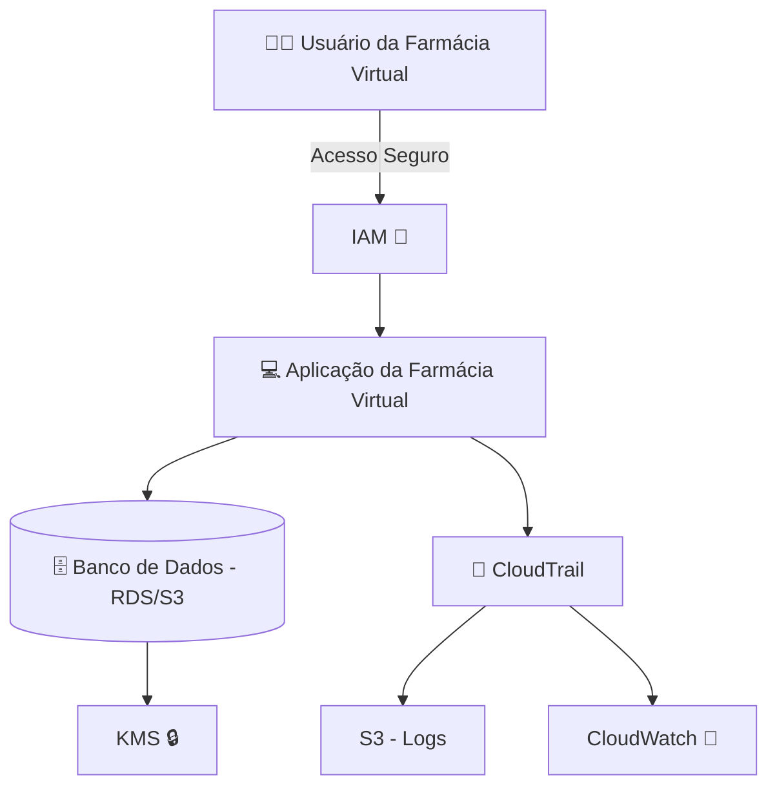

# 🔒 Projeto: Segurança em Farmácia Virtual na AWS

Este projeto tem como objetivo propor soluções de **segurança na nuvem** para uma farmácia fictícia que utiliza serviços da **AWS**.  
A ideia é demonstrar como aumentar a **confidencialidade, integridade e disponibilidade** do sistema, garantindo maior proteção dos dados de clientes, produtos e transações.

---

## 🚀 Ferramentas AWS Recomendadas

### 1️⃣ **AWS Identity and Access Management (IAM)**
- **O que é:** Serviço que permite gerenciar usuários, grupos e permissões de acesso.
- **Implementação:**
  - Criar usuários individuais para cada colaborador.
  - Utilizar **políticas de menor privilégio** (Least Privilege) para limitar acessos somente ao necessário.
  - Habilitar **MFA (Multi-Factor Authentication)** para aumentar a segurança do login administrativo.

---

### 2️⃣ **AWS Key Management Service (KMS)**
- **O que é:** Serviço de gerenciamento de chaves de criptografia.
- **Implementação:**
  - Criptografar dados sensíveis dos clientes (ex.: informações pessoais e de pagamento).
  - Gerenciar chaves automaticamente sem precisar se preocupar com infraestrutura própria.
  - Integrar o KMS a outros serviços (como S3, RDS e EBS) para que todos os dados sejam **armazenados criptografados**.

---

### 3️⃣ **AWS CloudTrail**
- **O que é:** Serviço que registra logs de todas as ações realizadas na conta AWS.
- **Implementação:**
  - Ativar trilhas para monitorar atividades suspeitas, como tentativas de login falhas ou alterações de configuração.
  - Configurar envio de logs para o **Amazon S3** para armazenamento seguro.
  - Integrar com o **Amazon CloudWatch** para gerar alertas automáticos em tempo real.

---

## 📊 Diagrama de Arquitetura (Segurança)



---

## 📌 Benefícios para a Farmácia Virtual

- ✅ Maior controle de acessos e usuários.  
- ✅ Dados dos clientes protegidos por criptografia.  
- ✅ Monitoramento contínuo contra acessos indevidos.  
- ✅ Conformidade com padrões de segurança exigidos no setor de saúde.  

---

## 📂 Estrutura do Repositório

```
/projeto-farmacia-seguranca
│── README.md          # Documentação principal
│── diagramas/         # Diagramas de arquitetura (opcional)
│── scripts/           # Scripts de configuração (opcional)
```

---

## 👨‍💻 Autor
Projeto desenvolvido como estudo prático de **segurança em nuvem com AWS**.  
